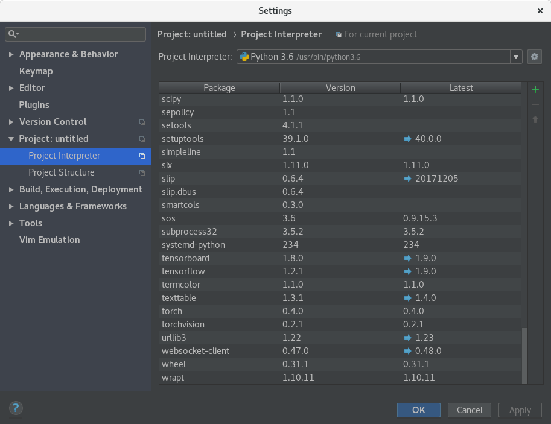

# Integrate TensorFlow (and Keras) with PyCharm

#### Document Objective
- Use ```python3``` and ```pip3```
- Install and load TensorFlow in PyCharm

## Install PyCharm
- Preference to ```python3``` and ```pip3```
  ```
  wget https://bootstrap.pypa.io/get-pip.py
  sudo python3 get-pip.py
  ```

- Download PyCharm from https://www.jetbrains.com/pycharm/
- Untar it in home dir

## Install TensorFlow
```
sudo pip3 install --upgrade tensorflow
```

## Install Keras
```
sudo pip3 install keras
```

## Install PyTorch (through proxy)
```
export https_proxy=http://IP:3128
sudo -E pip3 install torch torchvision
```

> You might need to quit then restart PyCharm to pick and load the new packages.

## Change interpreter in PyCharm to load TensorFlow and Keras
From PyCharm, File > Settings > Project Interpreter > change ```/usr/bin/python3.6``` in Project Interpreter



## PyCharm repo for Fedora under ```/etc/yum.repos.d```

```
[phracek-PyCharm]
name=Copr repo for PyCharm owned by phracek
baseurl=https://copr-be.cloud.fedoraproject.org/results/phracek/PyCharm/fedora-$releasever-$basearch/
type=rpm-md
skip_if_unavailable=True
gpgcheck=1
gpgkey=https://copr-be.cloud.fedoraproject.org/results/phracek/PyCharm/pubkey.gpg
repo_gpgcheck=0
enabled=1
enabled_metadata=1
```
