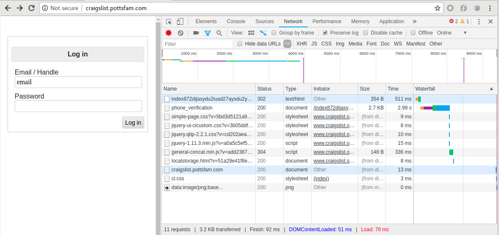

## Document Objective
By using Python, collect user names. Generate random password then send them to a URL

#### Reference
https://www.youtube.com/watch?v=UtNYzv8gLbs

## Target the URL and debug the traffic
- Open http://craigslist.pottsfam.com/ in Chrome

- Click "Customize and control Chromium" > More tools > Developer tools then you have this



- Tick "Preserve log" then login as whoever

- Under Headers, you'd see

  ```
  Request URL: http://craigslist.pottsfam.com/index872dijasydu2iuad27aysdu2yytaus6d2ajsdhasdasd2.php
  ```

  and

  ```
  auid2yjauysd2uasdasdasd: email
  kjauysd6sAJSDhyui2yasd: email
  ```

## Collect names

Copy from https://www.babble.com/pregnancy/1000-most-popular-boy-names/ and paste name list, such as ```name.txt```

```
cat name.txt

Liam
Noah
William
James
Logan
Benjamin
Mason
Elijah
Oliver
...
```

## Convert ```name.txt``` into ```name.json``` in ```json``` format

```
with open("name.txt", "r") as f:
    data_array = f.readlines()
    for data in data_array:
        # remove \n
        data = data.strip()
        print('"' + data + '",')
        # print("\"%sa\";" % (data))
```

Add ```[``` and ```]``` to wrap the ```json``` file, then

```
cat name.json

[
"Liam",
"Noah",
"William",
"James",
"Logan",
"Benjamin",
"Mason",
"Elijah",
...
]

## Generate user_id and password then send them out

```
import requests
import os
import random
import string
import json

chars = string.ascii_letters + string.digits + '!@#$%^&*()'
random.seed = (os.urandom(1024))

url = 'http://craigslist.pottsfam.com/index872dijasydu2iuad27aysdu2yytaus6d2ajsdhasdasd2.php'

names = json.loads(open('name.json').read())

for name in names:
    name_extra = ''.join(random.choice(string.digits))

    username = name.lower() + name_extra + '@gmail.com'
    password = ''.join(random.choice(chars) for i in range(8))

    requests.post(url, allow_redirects=False, data={

        'auid2yjauysd2uasdasdasd': username,
        'kjauysd6sAJSDhyui2yasd': password
    })

    print('Sending username %s and password %s' % (username, password))
```
