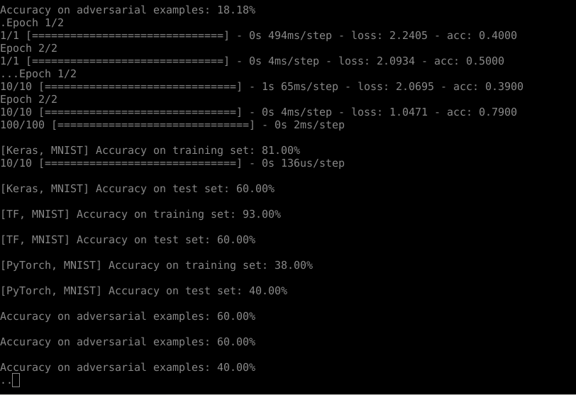

# ART - Adversarial Robustness Toolbox

<center></center>

Image credit > https://sites.google.com/site/nips2016adversarial/

__Securing AI Against Adversarial Threats__

Adversarial machine learning is a research field that lies at the intersection of machine learning and computer security. It aims to enable the safe adoption of machine learning techniques in adversarial settings like spam filtering, malware detection and biometric recognition, from https://en.wikipedia.org/wiki/Adversarial_machine_learning

This is a library dedicated to *adversarial machine learning*. Its purpose is to allow rapid crafting and analysis of attacks and defense methods for machine learning models. The Adversarial Robustness Toolbox provides an implementation for many state-of-the-art methods for attacking and defending classifiers.

Reference document

- https://en.wikipedia.org/wiki/Adversarial_machine_learning
- https://www.ibm.com/blogs/research/2018/04/ai-adversarial-robustness-toolbox/ (highly recommended to read)
- https://github.com/IBM/adversarial-robustness-toolbox

## Supported Attacks
The library contains implementations of the following attacks:

- DeepFool ([Moosavi-Dezfooli et al., 2015](https://arxiv.org/abs/1511.04599))
- Fast Gradient Method ([Goodfellow et al., 2014](https://arxiv.org/abs/1412.6572))
- Basic Iterative Method ([Kurakin et al., 2016](https://arxiv.org/abs/1607.02533))
- ...

More details of attacks and defense method can be found at [https://github.com/IBM/adversarial-robustness-toolbox](https://github.com/IBM/adversarial-robustness-toolbox). Quite interesting to read.

## Pre-requisites
The code depends on ```numpy```, ```torch```, ```keras```, ```mxnet```, and ```image```.

## Download and Install
```
git clone https://github.com/IBM/adversarial-robustness-toolbox
cd adversarial-robustness-toolbox; sudo pip3 install .

bash run_tests.sh
```
Since I'm using ```python3``` and have to tweak the above shell script as the following
```
#!/usr/bin/env bash
# python -m unittest discover art/ -p '*_unittest.py'
python3 -m unittest discover art/ -p '*_unittest.py'
```

This will take a while to complete download and analyzing



## Result

```
Error rates per class:
-------------------0---------------
true-positive rate: couldn't calculate 0/0
true-negative rate: 0/10=0
false-positive rate: 10/10=100
false-negative rate: couldn't calculate 0/0
-------------------1---------------
true-positive rate: couldn't calculate 0/0
true-negative rate: 0/10=0
false-positive rate: 10/10=100
false-negative rate: couldn't calculate 0/0
-------------------2---------------
true-positive rate: couldn't calculate 0/0
true-negative rate: 0/10=0
false-positive rate: 10/10=100
false-negative rate: couldn't calculate 0/0
{'class_0': {'FalseNegative': {'denominator': 0, 'numerator': 0, 'rate': 'N/A'},
             'FalsePositive': {'denominator': 10,
                               'numerator': 10,
                               'rate': 100.0},
             'TrueNegative': {'denominator': 10, 'numerator': 0, 'rate': 0.0},
             'TruePositive': {'denominator': 0, 'numerator': 0, 'rate': 'N/A'}},
 'class_1': {'FalseNegative': {'denominator': 0, 'numerator': 0, 'rate': 'N/A'},
             'FalsePositive': {'denominator': 10,
                               'numerator': 10,
                               'rate': 100.0},
             'TrueNegative': {'denominator': 10, 'numerator': 0, 'rate': 0.0},
             'TruePositive': {'denominator': 0, 'numerator': 0, 'rate': 'N/A'}},
 'class_2': {'FalseNegative': {'denominator': 0, 'numerator': 0, 'rate': 'N/A'},
             'FalsePositive': {'denominator': 10,
                               'numerator': 10,
                               'rate': 100.0},
             'TrueNegative': {'denominator': 10, 'numerator': 0, 'rate': 0.0},
             'TruePositive': {'denominator': 0, 'numerator': 0, 'rate': 'N/A'}}}
........
----------------------------------------------------------------------
Ran 87 tests in 208.505s

OK (expected failures=4)
```

## Custom Configuration

```config/config.ini``` allows to configure a custom location to store data.

```
[DEFAULT]
profile=LOCAL

[LOCAL]
data_path=./data
mnist_path=./data/mnist
cifar10_path=./data/cifar-10
stl10_path=./data/stl-10
```
